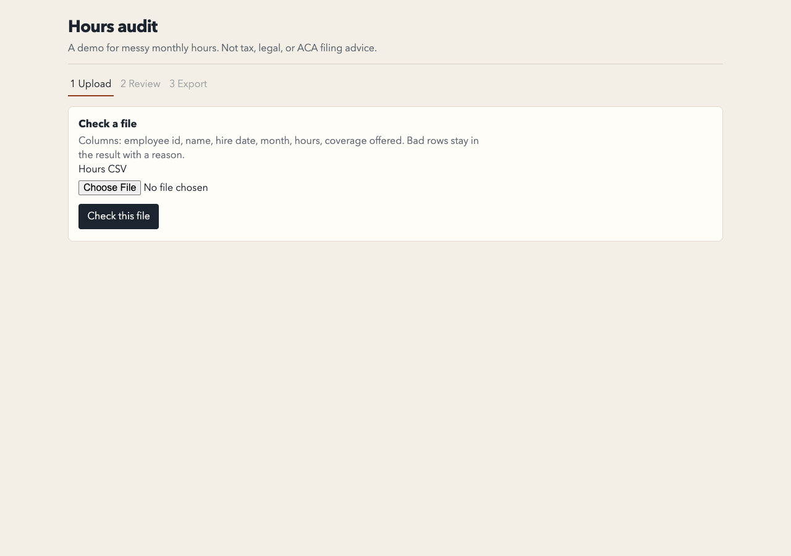

# Employee hours audit

A Go service reads a messy monthly-hours CSV, keeps every bad row for review with a reason, and writes an Excel workbook whose counts are formulas. The Svelte page is where a person fixes a row and checks it again.

It is a demo, not tax, legal, or ACA filing advice, and it does not produce Form 1094-C or Form 1095-C.

This is Option C, a Go API and a Svelte front end, also covering the CSV cleanup and Excel reporting from Options B and D.



## Run

```
go run ./cmd/audit testdata/employees_messy.csv -o /tmp/hours-audit.xlsx
```

Exit 0 writes the workbook even when some rows need review. Exit 1 is a read or parse failure. Exit 2 is usage. The built binary returns those codes. `go run` prints `exit status 2` and itself returns 1 when the program exits 2.

From the repository root:

```
go run ./cmd/server
```

That listens on `:8080` (or `PORT`). If `web/dist` exists, the same process serves the page at `/`.

```
cd web && npm install && npm run dev
```

Vite proxies `/api` and `/healthz` to port 8080.

Suggestions stay off unless `ANTHROPIC_API_KEY` is set on the server. The person has to accept a suggested value. It is never applied on its own. Do not commit `.env`.

## Approach

`encoding/csv` parses the file. A date must match one of five layouts. Slash dates are month/day/year. Hours must be a plain decimal from 0 through 744. Coverage must be a known yes or no word. Every copy of a duplicate employee and month is held. A month with at least 130 hours is full-time, which is the IRS monthly measurement method ([IRS: identifying full-time employees](https://www.irs.gov/affordable-care-act/employers/identifying-full-time-employees)). Look-back measurement is not implemented. A full-time month with no coverage stays on the clean sheet and is flagged. It is not a penalty determination.

The workbook uses excelize. Summary counts are formulas against the data sheets. Text that starts with `=`, `+`, `-`, `@`, tab, CR, LF, or the full-width forms of those characters gets a leading quote. The API is `net/http` and stores nothing. Uploads are limited to 1 MiB.

Left out on purpose: Form 1095-C codes, affordability, penalty amounts, a database, and logins.

## Tests

`go vet ./...` was clean. `go test ./... -race -cover` passed. `internal/record` was 93.6% of statements. The module was 79.1%. `FuzzParse` passed a 60-second run, 1,926,987 executions. Vitest passed 6 tests. Planted rows are listed in [testdata/README.md](testdata/README.md). Command output is in [docs/test-results.md](docs/test-results.md).

Manual check: upload `testdata/employees_messy.csv` (46 submitted, 18 clean, 28 in review), set row 45 to hours `40` and coverage `yes`, recheck, and download the workbook.

An agent wrote most of this. It was wrong where the flag parser ignored `-o` after the filename, where a pivot range quoted the sheet name itself, and where a catch-all `GET /` handled API routes. Those are fixed and tested. I would not let an agent choose which duplicate to keep, or apply a suggested value by itself.
